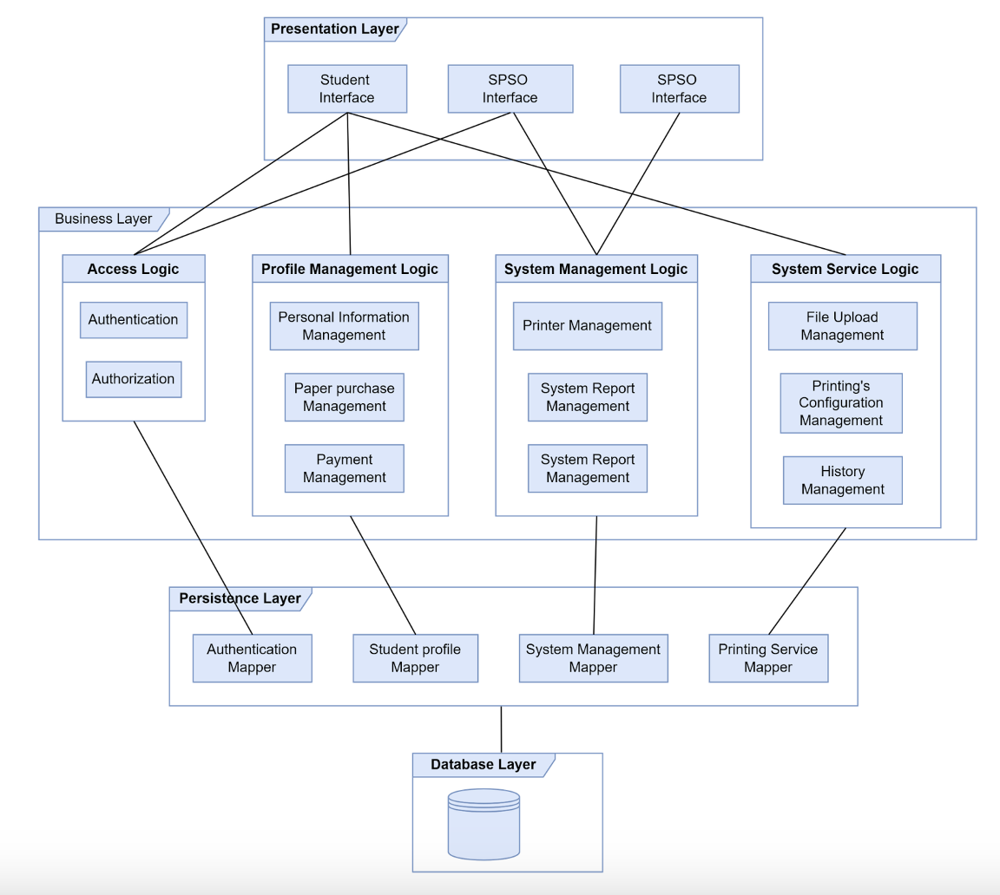
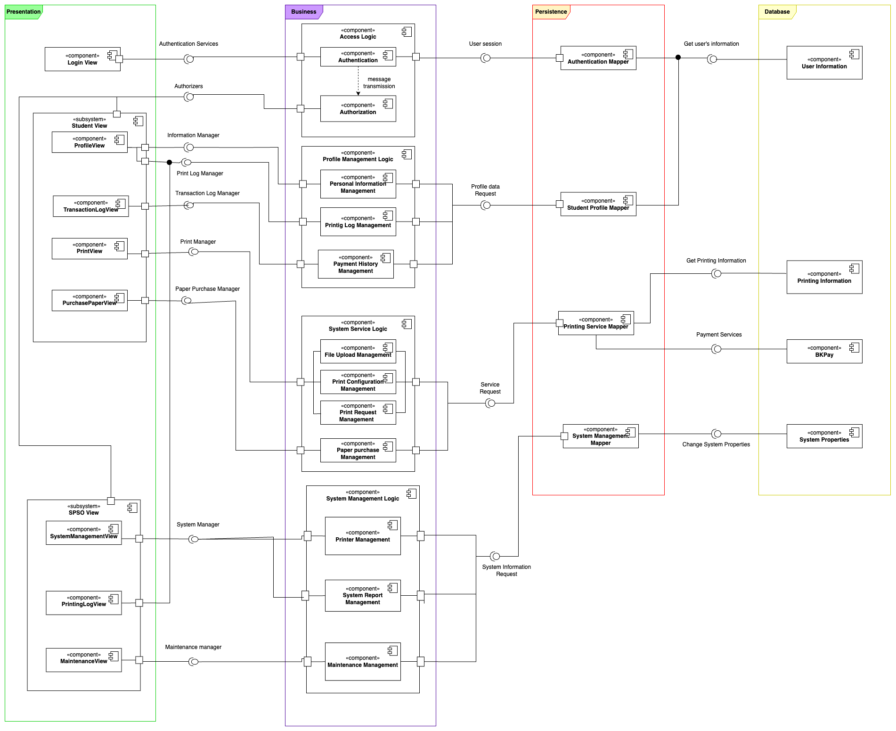

# Architecture Design

## Table of contents

- [1. Layer architecture](#1-layered-architecture)
- [2. Architerture decision](#2-architecture-decision)
    - [2.1 Presentation strategy](#21-presentation-strategy)
    - [2.2 Data storage approach](#22-data-storage-approach)
    - [2.3 API management](#23-api-management)
- [3. Component diagram](#3-component-diagram)
- [4. Diagram descriptions](#4-diagram-descriptions)

## 1. Layered architecture

    
    

        <strong>Fig. </strong>Layered architecture
    

## 2. Architecture decision

### 2.1 Presentation strategy

The HCMUT-SSPS website is a platform designed to provide a streamlined, user-friendly interface that enables users to remotely access and interact with the full suite of HCMUT-SSPS services. The design emphasizes ease of use, combining aesthetic appeal with intuitive functionality to ensure that students and SPS officers (SPSO) can efficiently perform tasks across a variety of devices, from desktops to tablets and mobile phones. The system’s responsive design automatically adjusts to fit different screen sizes, ensuring a smooth, consistent experience regardless of device.

Upon entering the website, users are welcomed with visuals on the homepage. To ultilize the system’s services, students and SPSOs are required to log in via a prominently placed login button. This login process is secured through HCMUT_SSO authentication, verifying each user’s identity and granting them access based on their role. For students, this role-based access opens up options to upload and print documents, check their printing history, and manage their account balance through a seamless BKPay integration. For SPSOs, role-specific functionality includes advanced access to system management controls, such as configuring default printing settings, adjusting quotas, monitoring printer status, and overseeing service usage.

Once logged in, users are taken to the main activity dashboard, designed for quick navigation and accessibility. Key services are represented by large, easy-to-identify icons, enabling users to select functions with minimal confusion. Students can initiate document uploads, set specific print properties (e.g., page size, single or double-sided printing), and review their printing history or transaction records. The system provides advanced filtering tools, allowing users to sort their print history by specific date ranges or by printer ID to quickly locate past records. For SPSOs, this feature extends to viewing the printing history of all students, organized by student ID, as well as tracking printer-specific usage.

SPSOs benefit further from centralized management capabilities. The system’s configuration settings allow them to handle important administrative tasks, such as adjusting page quotas and specifying approved file types. They can also perform printer management actions, including adding, enabling, disabling, and viewing individual printer details, such as ID, model, remaining paper count, and connection status. With each configuration update, clear feedback messages provide confirmation or error notifications, ensuring SPSOs are fully informed about each action’s outcome. In addition to configuration management, the interface automatically generates comprehensive reports on system usage, delivering monthly and annual summaries that can be accessed on-demand to assess service utilization and plan resource allocation.

To enhance user experience and convenience, the platform integrates the BKPay system for secure, on-the-go transactions, allowing students to seamlessly add funds for printing and manage their balance. Real-time transaction updates and intelligent notification alerts inform users of successful or failed transactions, providing transparency and helping users resolve any issues promptly. Furthermore, SPSOs can leverage these transaction insights, along with usage data, to better understand printing demands across campuses and make informed decisions about resource allocation.

A dedicated interface for each function ensures that all necessary information is displayed prominently and organized for easy comprehension. For example, the Print History and Print Settings pages feature smart search and filtering, enabling users to locate specific records without difficulty. Furthermore, for actions requiring user input, the interface includes validation to prevent errors and to provide timely feedback. Comprehensive support for all critical functions—from managing printer settings to tracking transaction history and responding to feedback—contributes to the system’s goal of a seamless, efficient user experience, all within a secure, role-defined environment tailored to the diverse needs of HCMUT students and SPS officers.

### 2.2 Data storage approach

To store data for the HCMUT-SSPS system, we propose using MySQL, a robust, flexible, and high-performance database management system. MySQL is highly optimized for handling complex queries and large data volumes, making it an ideal choice for our system, which needs to process user and printer data efficiently. High performance is essential because our system involves frequent data transactions related to user printing history, printer availability, and document uploads, all of which must be processed swiftly to provide real-time responses. MySQL supports ACID (Atomicity, Consistency, Isolation, Durability) properties, ensuring that every transaction is handled with full consistency and data remains reliable even in case of system failures. This consistency is critical as it guarantees that sensitive user data, such as account balances and print logs, is always accurate and synchronized.

Moreover, MySQL supports complex SQL queries, which will enable efficient retrieval, updates, and data processing, providing the flexibility to create comprehensive reports and logs for system management. It offers scalability to accommodate future growth in user and data volumes, ensuring that the system remains responsive even as demand increases. MySQL integrates seamlessly with common programming languages such as PHP, Python, Java, and more, making it easier to build and extend web-based applications. From a security perspective, MySQL offers strong access control mechanisms, data encryption, and activity monitoring to safeguard sensitive information from unauthorized access. The system will include key tables such as:

- *Printers*: his table will store data like printer ID, connection details (IP address, port, etc.), paper levels, and usage statistics.
- *Users*: This table will hold user information such as usernames, passwords (securely hashed), access rights, and their available printing quota.
- *Printed Documents*: This table will record information about documents printed by users, including document ID, filename, user who printed it, printer used, date, number of copies, and pages consumed.

This structured database design ensures that all data is organized, queryable, and easy to manage, providing a strong backbone for our system’s operations.

### 2.3 API management

The HCMUT-SSPS system relies on APIs (Application Programming Interfaces) to interact with external services such as the HCMUT_SSO authentication service for secure user login and BKPay for payment processing. An API is essentially a software interface that allows different applications to communicate and exchange data. Our system will utilize RESTful APIs (Representational State Transfer), which use standard HTTP methods like GET, POST, PUT, and DELETE to perform various operations. REST APIs are known for their simplicity, scalability, and lightweight nature, making them perfect for integrating with web-based applications.

The API management strategy for HCMUT-SSPS involves creating well-defined, secure endpoints to facilitate communication between our system and external services. When a user logs in, a request is sent to the HCMUT_SSO service, which authenticates the user using their school account credentials. Similarly, when a user makes a payment to buy additional printing credits, a request is sent to BKPay, which processes the transaction and returns a confirmation or error response. Each API request contains a URL (identifying the resource), a method (defining the operation), headers (carrying metadata like authentication tokens), and a body (containing the data payload). The response from the API includes a status code (indicating the result of the request) and a body with relevant data or error messages.

## 3. Component diagram

    
    

        <strong>Fig. </strong>The component diagram
    

## 4. Diagram descriptions

This component diagram illustrates the architecture for a Student Smart Printing Service (SSPS), organized into four layers: Presentation, Business, Persistence, and Database with each layer responsible for a distinct aspect of the service. 

The Presentation Layer contains user interfaces, such as Login View, Student View and SPSO View with each one designed for a type of user.  The Login View distinguishes between students and SPSO, navigating each one to a different interface and granting different authorization. The Student View allows students to access Profile View, Print View, and Maintenance View, allowing users to perform actions like logging in, managing profiles, viewing transactions, and handling print requests, respectively. The SPSO includes specialized views for administrative tasks like SystemManagementView for handling system properties and Printing Log View that allow them to view print logs of all students and printers.

The Business Layer encapsulates the core logic. Key components include Access Logic, Profile Management Logic, System Service Logic and System Management Logic. The Access Logic authenticate the login and authorize privileges. The Profile Management Logic allow user to view and manage personal information base on different level of privileges (student or SPSO). The System Service Logic provides operations like printing and purchasing more paper.The System Management Logic provides methods to facilitate SPSO’s job, such as: change system properties, export report and manage printers.

The Persistence Layer serves as an intermediary between the business logic and the database, managing data flow to and from the database through mappers. Components like Authentication Mapper and Student Profile Mapper handle user authentication and profile data requests, while Printing Service Mapper Mapper deals with print services and System Management handles system settings.

Finally, the Database Layer stores critical data required for the system, including User Information, Printing Information, BKPay (for payments), and System Properties. Communication across layers occurs through defined data flows, with user sessions and profile data requests moving from the Presentation Layer through Business and Persistence to Database for data retrieval.
