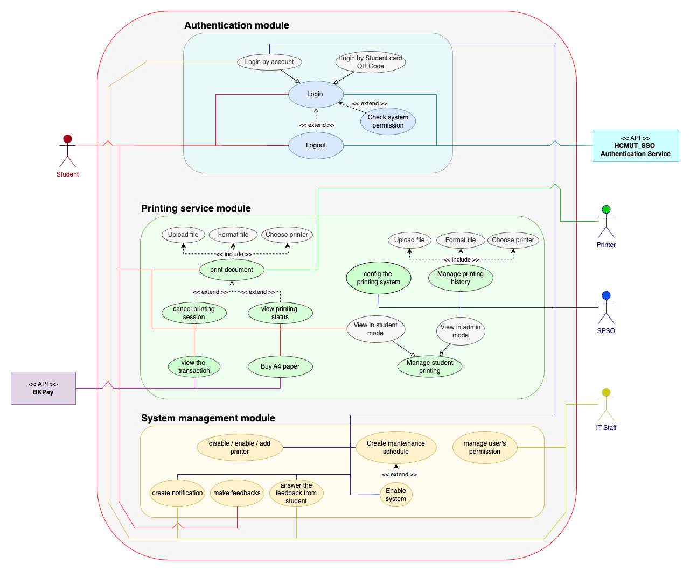
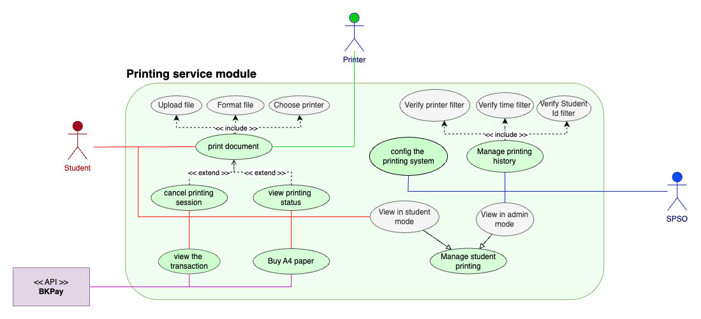

# Requirement elicitation

## Tables of content
- [1. Domain Context](#1-domain-context)
- [2. Needs](#2-needs)
- [3. Benefits](#3-benefits-of-the-system)
- [4. Functional Requirements](#4-functional-requirements)
    - [4.1 Students](#41-students)
    - [4.2 SPS Officer](#42-sps-officer)
    - [4.3 IT Staff](#43-it-staff)
    - [4.4 BKPay](#44-bkpay)
    - [4.5 HCMUT SSO Authentication Service](#45-hcmut_sso-authentication-service)
- [5. Non-functional Requirements](#5-non-functional-requirements)
- [6. Use-case diagrams](#6-use-case-diagrams)

## 1. Domain Context

Known as one of the schools with the most hard course programs in the country, Ho Chi Minh Bach Khoa university requires high effort from students to graduate. One of the special aspects from Bach Khoa university is the huge resource of documents that students need to study throughout the school time, which stimulates the need for printing of the student. On the grounds of that, printing service in the campus of the school rises as an amazing and very practical service for supporting the student’s study. However, with the enormous demand from a big number of students, it is essential for having a software program that can provide services efficiently for students as well as make the management from the school easier.
This system will control everything students need related to documents printed via printer, including their printing registration, printing history and payment method. In terms of SPS Officers - manager of printers, they can handle the printing related information such as permitted file type, any trouble of the printers and the printing history of every student.
There are 3 stakeholders:
+ Students: the user of the system, must be able to upload and print files, access their printing record and conduct transactions.
+ SPS Officer: manage the physical printer and student’s activities, be able to read monthly and annually reports, as well as all student’s records and information;
+ IT staff: maintain and update the system,  should be able to access student’s information and other data, such as accounts and passwords; be able to grant and deny any access and other privileges.
+ HCMUT_SSO Authentication Service: They take responsibility for the user authentication of the system. The user of the system must be able to connect to the HCMUT_SSO to login.
+ BKPay: They take responsibility for managing and performing the payment function of the software.

## 2. Needs
- **Students**: Printing learning documents is an essential need for every student for serving the learning purpose. The most convenient way may be printing inside the university campus so that students can print the documents immediately before coming to class. Also, students may need security for their printing documents since they don’t want their documents to be stored on computers in photocopying shops.

- **SPSO Staff**: SPSO staff require the ability to easily manage printers, configure system settings like file types and student page quotas, and monitor printing usage across multiple campuses. Furthermore, the staff need control over critical configurations, such as setting student page quotas, adjusting default allowances each semester, and managing the types of files allowed for printing. With large numbers of students utilizing the service, it is essential to have a detailed logging system that tracks each student’s printing activities so that the SPSO can monitor usage patterns and resolve issues efficiently. SPSO staff also need seamless integration with the university’s authentication system (HCMUT_SSO) to ensure that only authorized users can access the printing services, adding an extra layer of security to the process. Finally, staff need the ability to configure and monitor the payment gateway for buying additional pages (via BKPay) to ensure students can easily manage their printing balances.

- **IT**: IT staff need to keep an eye on how the printers and the system are working. They must ensure everything runs smoothly and fix issues immediately when they happen. In addition, they need to perform right granting, that means, decide which individual has which right to perform some actions in the system. Furthermore, IT staff need to research the experiment of the user when using the software. Finally, IT staff need a way to notify the users about the plan to update, disable the system as well as the updating of the system.

- **BKPay**: they take responsibility for performing all of the transactions in the software. They need a user interface so that users can call to the BKPay system to perform the transaction process for buying paper to print.

- **HCMUT_SSO Authentication Service**: they take responsibility for doing the authentication for the user by the school-wide backend system. They need a way to connect with the user in the SPS software, so that the user can contact them and use their authentication function to login and use the service in SPS software.

## 3. Benefits of the System

- **Students**: Smart printing service may be an amazing equipment which serves studying purposes, as students can print their documentation directly in the school. It provides conveniences for students by: firstly allowing them to register for printing online and get the documents inside the campus. Secondly the BKpay system helps students to pay at once via the online systems for multiple usage. Also, students can now review what they have printed by the printing history functionality. One interesting thing is that the SSPS can guarantee privacy for the students by limiting the access and view of the others to their documents. Finally, the automatic software can help to reduce the manual cost for the printer, hence the fee for printing may be cheaper.

- **SPS Officers**: SPSO benefits from centralized and convenient management of all printers across the campus through a single system, allowing them to easily add, activate, or disable printers without the need for physical interaction. This centralized system reduces the administrative workload by automatically logging all student print activities, thus saving time that would otherwise be spent on manual tracking. Transparency and easy tracking are ensured as SPSO can view detailed reports on printing activities for each student, printer, or within specific time periods, facilitating easy monitoring and quick issue resolution. The system also offers automated reporting, generating monthly and yearly reports on usage, which SPSO can access anytime to better assess and adjust services. Moreover, the system is highly flexible, enabling SPSO to configure settings such as adjusting the default number of pages allocated to students, permitted file types, and other configurations with ease. It also reduces errors and resource wastage by ensuring students can only print within their account balance, helping to save paper and ink. The integrated online payment feature, such as through BKPay, further streamlines the process by eliminating manual payment handling. This comprehensive data on printing activities supports improved analysis and decision-making, allowing SPSO to better understand actual demand and optimize resource allocation. Finally, the system enhances security and access control by using HCMUT_SSO authentication, ensuring that only authorized students and staff can access it.

- **IT**: When IT staff play the role of a stakeholder, they can benefit from this software project in numerous ways. They will be responsible for maintaining the reliability, security, and efficiency of the platform, therefore, the system will provide them a centralized platform to manage and handle updates, troubleshoot issues and receive feedback about bugs, glitches from other users. The monthly and yearly reports will also give valuable insight about system performance and usage, which will elevate capacity planning and resource allocation, as well as significantly reduce IT staff’s workload.

- **BKPay**: the users can perform the transaction by using BKPay.

- **HCMUT_SSO Authentication Service**: users can login and be active in the system using their school account (mybk account).

## 4. Functional Requirements

### 4.1 Students

- Login the system by the HCMUT_SSO authentication service.

- Login the system by scanning the QR code of the student identity card.

- Logout the system.

- Print the document:
    * Upload a document file onto the system for printing.
    * Choose a printer to print documents.
    * Specify the printing properties: paper size (A3 or A4), one or doubled sided, number of copies, pages to be printed, ... .

- Buy A4-size pages to print through an online payment system by BKPay.

- View a record of previous transactions.

- See the number of available A4 left and printing information of previous printing, include document to be printed, printing properties and where to print.

- Send the report/feedback to the system.

- Receive and read the notifications of the system. 

- Not allow printing more when the number of allowed A4-size paper is run out.

### 4.2 SPS Officer

- Login by the HCMUT_SSO authentication service. The program must check the rights of SPSO managers.

- Logout the system.

- Config the system: set choices of file types, change the default number of pages, the dates that the system will reset the available pages and other system attributes.

- Add, enable, disable printers devices.

- View the printing history (log) of all students or each student within a period.

- View the printing history of all printers.

- Be able to view monthly and annually reports.

- Be able to update the printers’s metadata: brand/manufacturer name, printer model, short description, and the location.

- Receive notifications whenever a printer has errors or runs out of paper.

- Read and answer the report/feedback of the students.

- Make notifications for the system.

### 4.3 IT Staff

- Read and answer the report/feedback of the students.

- Disable or unlock the whole system (to maintenance).

- Make notifications for the system.

- Add, enable, disable printers.

- Change the password of the system’s user.

- Perform add/delete/update the right for any user.

### 4.4 BKPay

- A module that can redirect the user from the SPS software to the BKPay to do the transaction.

- Notify the user about the result of transaction after they perform

- Showing the user their transaction history.

### 4.5 HCMUT_SSO Authentication Service

- Login function, in which the system forwards the username and password for verifying in the HCMUT_SSO backend.

- Notify the user about the error if the login fails (maybe due to not found username, wrong password or network error,.. ).

- Logout function.

## 5. Non-Functional Requirements

- Must be active in the working time of the university (7:00 a.m to 6:00 p.m).

- The confirmation of the printing registration is sent to the student intermediately.

- The system must be clear and easy-to-use: every student can use the system after a short guideline.

- The system must intermediately satisfy the valid requirements of the users.

- The system must be operated on both web-based apps and mobile-based apps.

- The payment functionality must be 24/7.

- All transactions must be authorized by the system and conducted through Internet banking.

- Student’s information must be protected and encrypted to prevent unauthorized access.

- Synchronization with HCMUT_SSO authentication service for login and Internet Banking Services for payment purposes.

- The system must be synchronized and consistent with the University’s database for student’s information.

- The system must report and present the status of all of the printers in time, e.g, which printer is disabled, which is broken, and the paper left in each printer,… .

## 6. Use Case diagrams

In this part, we show 2 diagram: one for the whole system and one for a main module which we choose printing service module.

### 6.1 System

  

### 6.2 Printing service module

  

