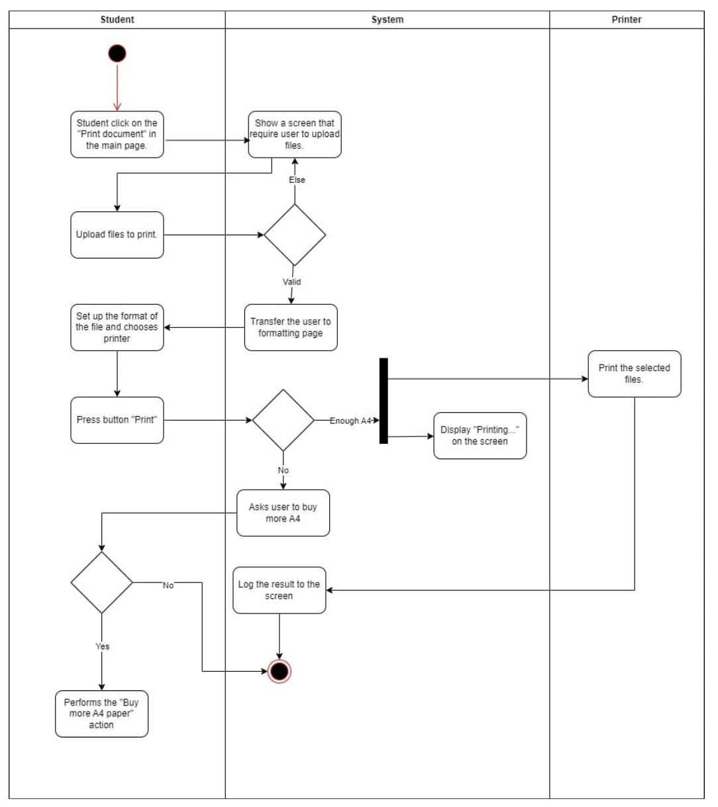
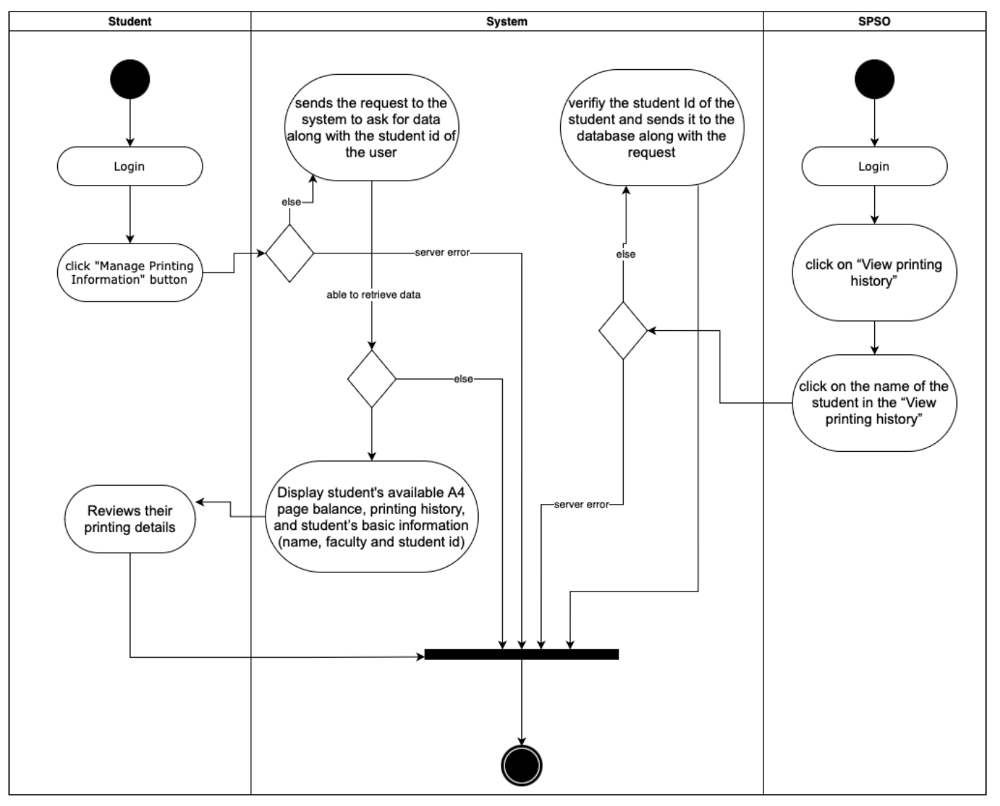
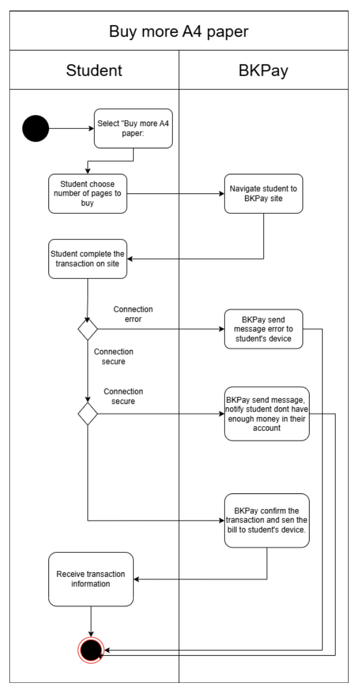
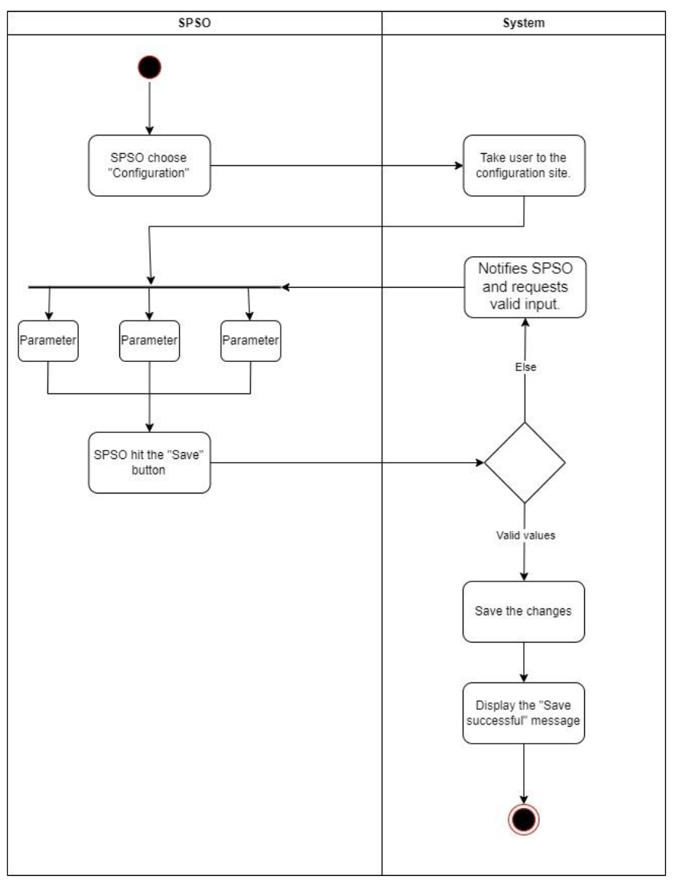
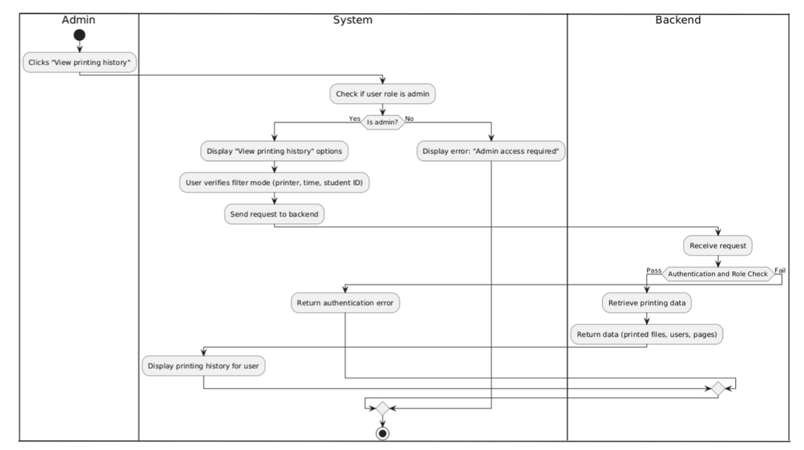
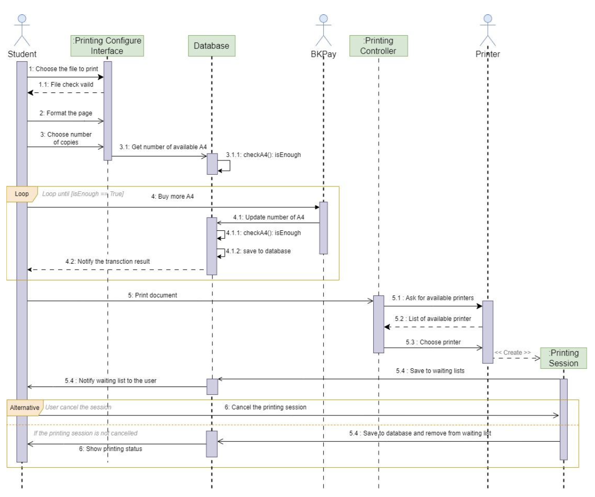
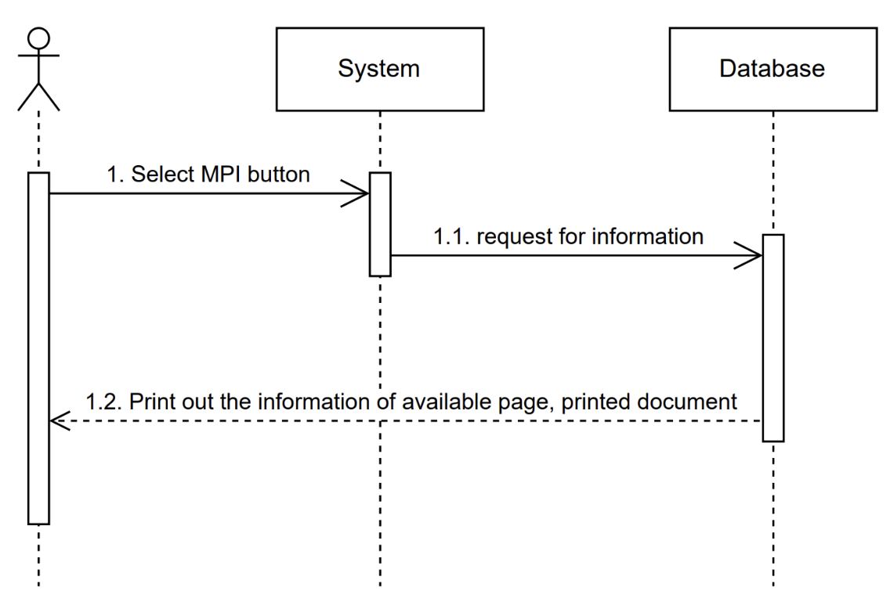
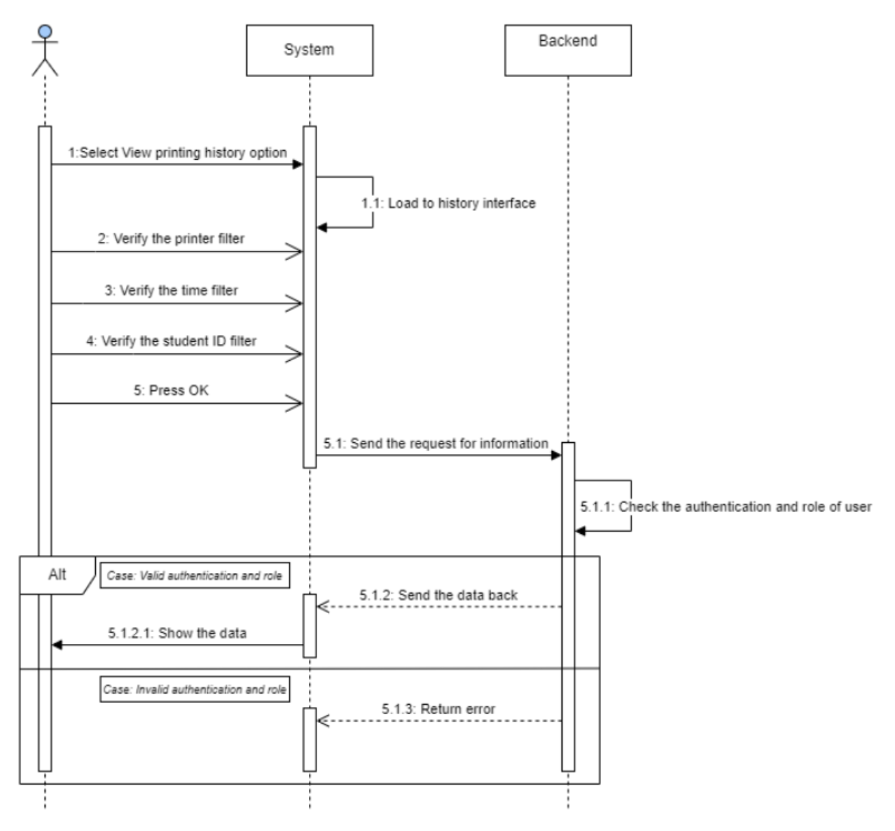
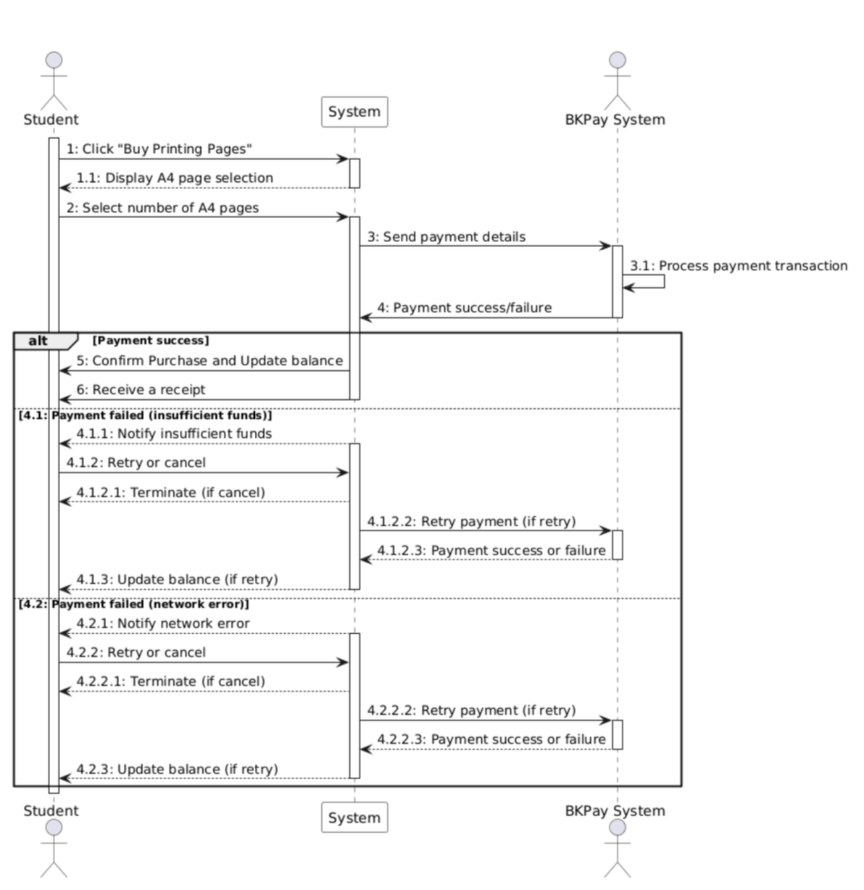
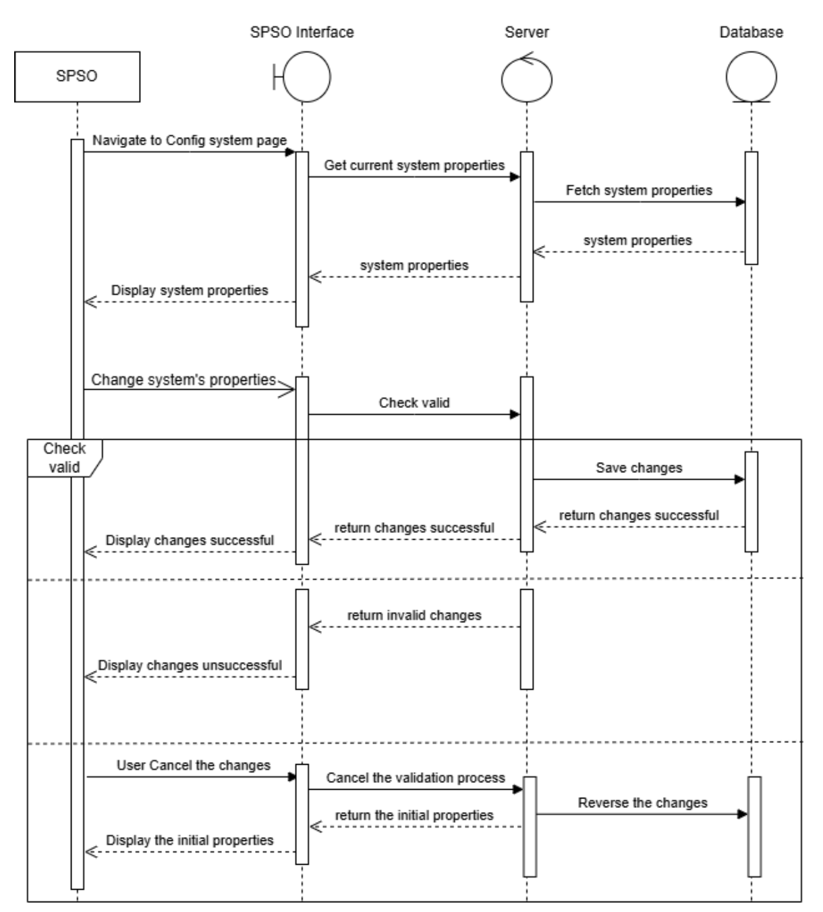

# System Modeling

## Tables of content

- [1. Activity diagrams](#1-activity-diagrams)

## 1. Activity diagrams

### 1.1 Print document

    
    

        <strong>Fig. </strong>Activity diagram for Print document module
    

This activity diagram outlines the process of a student printing a document through a system. The sequence begins with a student clicking the `Print` button on the main page. The system then prompts the student to upload the desired files. Once uploaded, the system verifies the file format and prompts the student to select the printer and paper settings. If there is sufficient paper, the system initiates the printing process and displays a Printing message on the screen. However, if the paper is low, the system will notify the student to purchase more paper and guide them through the purchasing process. Finally, the system logs the printing result.

### 1.2 Manage student printing

    
    

        <strong>Fig. </strong>Activity diagram for Manage student printing module
    

This diagram details the process of managing and viewing student printing information, involving three entities: the student, the system, and the Student Printing System Operator (SPSO).
The student logs in, clicks "Manage Printing Information," and the system sends a request with the student's ID to verify and retrieve data from the database. If successful, the system displays the student's A4 page balance, printing history, and basic details, allowing the student to review them; otherwise, a server error message is shown. Simultaneously, the SPSO logs in, accesses "View printing history," and selects a student’s name to view their printing details, with the system similarly verifying the student’s ID. If any server or verification error occurs in either flow, the process is interrupted, and an error is displayed.

### 1.3 Buy A4 Paper

    
    

        <strong>Fig. </strong>Activity diagram for Buy A4 paper module
    

This activity diagram describes the process in which student select number of A4 pages and conduct payment through the BKPay website. In this process, students navigate to the payment section and select the number of pages to buy. Then the app will navigate the student to the BKPay website and a QR code with the required amount is displayed on the screen. The student then continues to complete the payment and one of the three cases can happen. First, if the BKPay doesn't receive the transaction after a certain amount of time, the transaction will be canceled and an error message will be sent to the student’s device. Second, if the students conduct the transaction but their accounts don't have enough money, BKPay will send a notification to the student’s device. Lastly, if the transaction is successful, BKPay confirms the transaction and sends the bill to the student's device.

### 1.4 Activity diagrams for configuring the system

    
    

        <strong>Fig. </strong>Activity diagram for system configuration module
    

The activity diagram for the "Config System" module illustrates the interaction between the Student Printing Service Officer (SPSO) and the system to update configurations. The process begins with the SPSO selecting the "Configuration" option, which navigates them to the configuration interface. Here, the SPSO adjusts various parameters, such as default pages, printer status, or permitted file types. After making the desired changes, the SPSO clicks the "Save" button. The system then validates the input. If invalid parameters are detected, the system notifies the SPSO to correct the input. If the values are valid, the system saves the changes and displays a "Save successful" message, completing the configuration process. This diagram highlights a streamlined workflow with clear checkpoints for validation, ensuring efficient and error-free configuration management.

### 1.5 Manage printing information

    
    

        <strong>Fig. </strong>Activity diagram for Manage printing information module
    

This activity diagram illustrates the process of an admin viewing printing history. It starts when the admin clicks "View printing history," prompting the system to check if the user has admin privileges. If the user is not an admin, an error message appears stating "Admin access required." If the user is an admin, they are shown filtering options (e.g., by printer, time, or student ID), after which a request is sent to the backend. The backend receives the request, checks the user's authentication and role. If the check fails, an authentication error is returned. If successful, the backend retrieves the printing data (including printed files, users, and pages) and returns it to the system, which then displays the printing history for the admin to view.

## 2. Sequence diagrams

### 2.1 Print document

    
    

        <strong>Fig. </strong>Sequence diagram for Print document module
    

<!-- *(High quality image can be found [here](https://drive.google.com/file/d/1mwKipchc3g1iY-SgZdlF4lyY7VMo7HmK/view?usp=drive_link))* -->

In the printing process, first, the student uploads the file to the system, in which the printing configure interface will check the validity of the file. Then, the student needs to choose the format of the page as well as specify the number of copies to be printed. Next, the printing configure interface needs to get the number of available A4 that the student can use, from the database. If the number of available A4 pages is not enough, then the student must buy more A4 paper through the BKPay system. The printing process continues when the student has enough A4 paper to print. After the number, the student prints a document by choosing one printer from a list of available printers (check by Printer Controller). When a printer is chosen, the printer creates a printing session. A student can cancel the printing session. As soon as the printing session completes successfully, printing data is saved to the database and a printing status is sent to the student.

### 2.2 Student printing

    
    

        <strong>Fig. </strong>Sequence diagram for Student printing module
    

The student selects the "Manage Printing Information" (MPI) button, prompting the system to retrieve and display the student’s available A4 page balance, printing logs, and transaction history from the database.

### 2.3 Manage printing information

    
    

        <strong>Fig. </strong>Sequence diagram for Manage printing information module
    

The sequence diagram illustrates the process for an admin user to view the printing history. First, the user clicks on "View printing history" and selects filters like printer, time, and student ID. The system then sends a request to the backend to get the printing history data based on these filters. The backend checks if the user is an admin and, if everything is okay, retrieves the data and sends it back to the user interface. Finally, the system displays the printing history. If the user is not authorized, an error is returned instead.

### 2.4 Buy A4 paper

    
    

        <strong>Fig. </strong>Sequence diagram for Buy A4 paper module
    

In this sequence diagram, first, the diagram illustrates the process of a student purchasing A4 paper through an online system using BKPay for payment. The student initiates the process by selecting the desired number of pages, prompting the system to send a payment request to BKPay. BKPay processes the payment and notifies the system of the outcome. If the payment is successful, the system updates the student's page balance and sends a confirmation with a receipt. However, if the payment fails due to insufficient funds or a network error, the system notifies the student and provides options to retry or cancel the transaction. This diagram effectively visualizes the interactions between the student, the system, and BKPay, highlighting the different scenarios and system responses based on the payment outcome.

### 2.5 Config system properties

    
    

        <strong>Fig. </strong>Sequence diagram for Config system properties module
    

In this scenario, first the SPSO using an authenticated and logged account can request to view the current system’s properties and the app’s interface will navigate to the desired page where the system’s properties are displayed. Then they can decide to change the system properties. The interface will then pass the data to the server, where the changes will be validated. If the changes are valid, the new system’s variables will be saved to the database and the interface will send a notification to SPSO, indicating that the modification is a success. On the other hand, if the changes are invalid, no changes will be made and an error message will be sent to SPSO. During the validation process, if the SPSO chooses to cancel, the server will reverse all the changes and return the initial properties.

## 3. Class diagram

    
    

        <strong>Fig. </strong>Class diagram of the system
    

*Link drive for detail: [here](https://drive.google.com/file/d/1k3dIW8ExWyupB16Vn4DvB2nhsLA5ZB0C/view?usp=sharing)*

In our project, we use Entity-Control-Boundary pattern which follows Model-View-Controller framework. In the following part, we summarize the class components.

### 3.1 App

- This is the root component of the website where it stores the information of the current user (either student or SPSO manager)

### 3.2 List of Entities

- **Student**: store student information, including `name`, `student_id`, `email`, `major` and `paper_balance` (for printing service).

- **Printer**: store printer information, including `printer_id`, `location` and `is_available` which indicates where that printer is ready for printing or not.

- **File**: store information of uploaded file for printing, including `file name`, `file size`, `content` and `student_id` which indicates the owner of the file.

- **Printing Log**: store information of 1 finished printing session, including `student_id` (who conduct the printing), `printed_date`, `printed_file`, `number_of_pages`, `number_of_copies` and `printer_id`.

- **WaitingPrintSession**: store information of a waiting printing session which is already registered, including `printed_date` (null if not printed yet), `file`, `list_of_printed_page`, `number_of_copies`, `printer_id`, `paper_side`, `paper_size`, `status` (waiting, printed, canceled).

- **SPO Manager**: store information of SPO manager who have admin permission, information including `id` and `name`.

- **PrintingConfig**: store config information of printing service, including `file_type`, `periodically_A4_received`, `received_period` (every month, every semester, ...)

- **MaintenanceSession**: store information of maintenance session, including `maintenance_id`, `title` (indicates reason for maintenance), `created_at`, `created_by`, `duration`, `status` (either not started, in progress or finished).

### 3.3 List of Controls

- **Student Information Page Control**
    + `getPrintingHistory(in s: Student)`: Retrieve list of printing log of given student from entity Printing Log

- **BuyA4Paper Controller**
    + `updatePaperBalance(in s: Student, in page: number)`: Add page to paper_balance of student s

- **Print Document Page Controller**:
    + `getWaitingList(in s: Student)`: Retrieve list of waiting print file of given student from entity WaitingPrintSession
    + `cancelPrinting(in f: WaitingPrintSession)`: Set the status of waiting file f to failed and stop the printer to print the file f
    + `getAvailablePrinters()`: Get the number of available printers from Printers entity
    + `checkPaperBalance(in s: Student, in page: int)`: Check whether number of A4 left is sufficient for printing or not
    + `createWaitingPrintSesion(in f: File, in side: PaperSide, in size: PaperSize, in print_pages: List[int], in num_of_copies: int)`: Create new waiting print session with initial status pending (waiting)

- **Printing History Page Controller**:
    + `getPrintingHistory(in printer_id: string {id}, in time: FilterTime, in student_id: string {id})`: Get a list of printing logs of selected printer, selected student within filter time. The default value for each selection will be all if its value is passed as null

- **System Management Page Controller**:
    + `getPrintingConfig()`: Get the printing config attributes of the system
    + `getCurrentMaintenanceSession()`: Get the maintenance that has status InProgress, if it doesn’t exit, return Null
    + `updatePrintingConfig(in file_type: string, in page: int, in period: ReceivedPeriod)`: Update the attributes of printing config
    + `getPrinterList()`: Get the list of printer from Printer entity
    + `disablePrinter(in p: Printer)`: Change the attribute is_available of printer to false
    + `enablePrinter(in p: Printer)`: Change the attribute is_available of printer to true

### 3.4 List of Views

- **Login Page**:
    + `login(in is_admin: bool)`: Call `authentication()` api from HCMUT_SSO Authentication service to get user, then call `setUser()` from App to set current user to App

- **Student Information Page**:
    + `displayStudentInformation()`: Display information of current student which is stored in *App*
    + `getPrintingHistory(in s: Student)`: Call `getPrintingHistory()` from the StudentInformationPageController to get printing history of current student
    + `displayPrintingHistory()`: Display list of printing log on the screen
    + `displayA4Left()`: Display number of A4 left of current user on the screen
    + `displayNumberOfPrinted Documents()`: Display the total number of printing logs

- **Buy A4 Paper**:
    + `displayOptionList()`: Display list of buy options
    + `SelectBuyOption(in op: BuyOption)`: Select one of the buy options
    + `fillNumberOfPages(in n: int)`: Fill in number of pages to buy when select custom option
    + `pay(in pages: int)`: Call `performTransaction()` api from BKPay to conduct the transaction. If the transaction is successful, it calls `updatePaperBalance()` to update paper balance of current user

- **View Transaction Log Page**:
    + `getTransactionLog(in s: Student)`: Call `getTransactionLog()` of BKPay api to get list of transaction of current user
    + `displayTransactionLog()`: Display transaction log of current user
    + `displayA4Left()`: Display number of A4 left of current user
    + `displayTransactionCount()`: Display number of transactions which is length of transaction log

- **Side Nav Menu**:
    + `onGoToPersonalInformationPageButtonClick()`: Switch to personal information page after clicking on Personal Information button
    + `onGoToPrintDocumentPageButtonClick()`: Switch to print document page after clicking on Print Document button
    + `onGoToViewTransactionLogPageButtonClick()`: Switch to transaction log page after clicking on Transaction Log button
    + `onGoToBuyMoreA4PageButtonClick()`: Switch to buy more A4 paper after clicking on Buy More A4 button
    + `onLogoutButtonClick()`: Call `logout()` from App and then switch to login page

- **Print Document Page**:
    + `file`: Current file to config printing properties
    + `printing_mode`: If false, then it displays the uploaded page, otherwise it displays the properties selection page.
    + `getPrintingHistory(in s: Student)`: Call `getPrintingHistory()` from the StudentInformationPageController to get printing history of current student
    + `displayPrintingHistory()`: Display list of printing log on the screen
    + `getWaitingList(in s: Student)`: Call `getWaitingList()` from the PrintDocumentPageController to get current list of waiting files of current student
    + `displayWaitingList()`: Display list of waiting files on the screen
    + `onCancelPrintingFileButtonClick(in f: WaitingPrintSession)`: Call `cancelPrinting()` from the PrintDocumentPageController to cancel the file waiting to be printed
    + `onChoosePrintedFileButtonClick(in f: File)`: Set file to the chosen file and printing_mode to true
    + `onUploadFile()`: Choose file to upload from computer, set file to chosen file and printing_mode to true

- **PrintingMode**:
    + `displayFile()`: Display preview of current file
    + `onCloseButtonClick()`: Set printing_mode to true, file to null and switch to print document page
    + `displayFileAttribute()`: Display attributes of current file, including name, size, number of pages
    + `onPaperSideSelected()`: Select side of paper (either one or both sides)
    + `onPrintPagesSelected()`: Select list of pages of current file to print
    + `onPaperSizeSelected()`: Select paper size (either A3 or A4)
    + `onNumberOfCopiesSelected()`: Select the number of copies
    + `getAvailablePrinters()`: Call `getAvailablePrinters()` from PrintDocumentPageController to get list of available printers
    + `onPrinterSelected()`: Select printer to register for printing
    + `onDisplayA4Required()`: Display number of A4 required to conduct the printing
    + `onGoToBuyMoreA4PageButtonClick()`: Switch to buy more A4 page
    + `onPrintButtonClick(in fL File, in side: PaperSide, in size: PaperSize, in print_pages: List[int], in num_of_copies: int)`: Call `printDocument()` from PrintDocument PageController with passing arguments to conduct the printing

- **PrintingHistoryPage**:
    + `printer_id`: The ID of the selected printer, Null indicates no specific printer is selected, instead all printers
    + `time`: The user specific filter interval which is All by default.
    + `student_id`: The ID of the selected printer, Null indicates no specific student is selected, instead all students
    + `printing_history`: List of printing logs based on current filter information
    + `displayFilterOptions()`: Display filter options, including printer, student and printed interval
    + `onPrinterSelection(in printer_id: string)`: Select the printer from list of printer id or set to Null for all printers selection
    + `onTimeFilterSelection(in time: FilterTime)`: Select printed interval to filter
    + `onStudentFill(in student_id: string {id})`: Fill in id of student to filter
    + `getPrintingHistory(in printer_id: string {id}, in time: FilterTime, in student_id: string {id})`: Call `getPrintingHistory()` from PrintingHistoryPageController to get list of printing history based on specified filter information
    + `displayPrintingHistory()`: Display list of printing after getting
    + `displayPrintStatistics()`: Display print statistics of filtered printing history

- **SystemManagementPage**:
    + `printers`: List of printers
    + `current_maintenance`: Current maintenance session, Null indicates no maintenance session at that time
    + `printing_config`: Printing config of system
    + `getPrintingConfig()`: Call `getPrintingConfig()` from SystemManagementPageController to get printing config attributes
    + `displayPrintingConfig()`: Display printing config after retrieving
    + `addFileType(in file_type: string)`: Add allowed file type of print document
    + `removeFileType(in file_type: string)`: Remove allowed file type of print document
    + `onA4ReceivedSelection(in page: int)`: Select the number of A4 periodically received
    + `onReceivedPeriodSelection(in t: ReceivedPeriod)`: Select the period of received A4 which is among Month, Semester, Year
    + `updatePrintingConfig(in file_type: string, in page: int, in period: ReceivedPeriod)`: Call updatePrintingConfig() from SystemManagementPageController to update the printing config by the specified attributes
    + `getCurrentMaintenanceSession()`: Call `getCurrentMaintenanceSession()` from SystemManagementPageController to get the current maintenance session in which Null indicates no maintenance session happens at the moment
    + `displayCurrentMaintenanceSession()`: Display current maintenance session if existing
    + `getPrinterList()`: Call `getPrinterList()` from SystemManagementPageController to get list of printers from Printer entity
    + `displayPrinterList()`: Display list of printers after retrieving
    + `disablePrinter(in p: Printer)`: Call `disablePrinter()` from SystemManagementPageController to disable the chosen printer
    + `enablePrinter(in p: Printer)`: Call `enablePrinter()` from SystemManagementPageController to enable the chosen printer

### 3.5 API Class

- **HCMUT_SSO Authentication Service**:
    + `authentication()`: Authenticate and send back the student information of user
    + `performTransaction(in s: Student, in money: float)`: Perform the transaction and send back the result whether successful or not
    + `getTransactionLog(in s: Student)`: Get the list of buying transaction of user s

